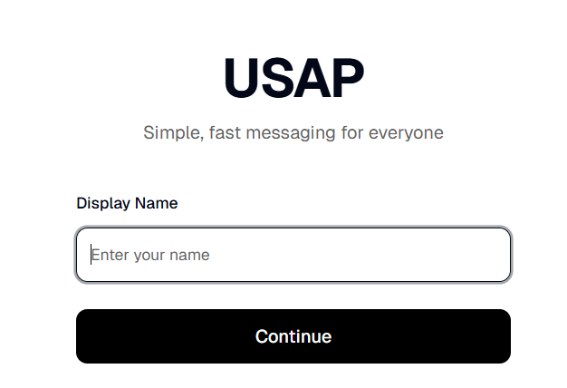

# Minimalist Messenger App

A simple Next.js chat application with server-based messaging.



## Features
- Create/join chat servers with unique codes
- Real-time messaging with polling
- In-memory message storage (last 100 messages)
- Clean UI with Tailwind CSS and shadcn/ui

## Tech Stack
- Next.js 16
- React 19
- TypeScript
- Tailwind CSS
- shadcn/ui components
- Bun package manager

## Getting Started
```bash
bun install
bun run dev
```

Open http://localhost:3000 to start chatting.
